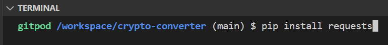
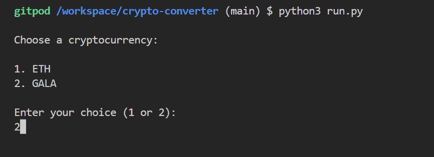
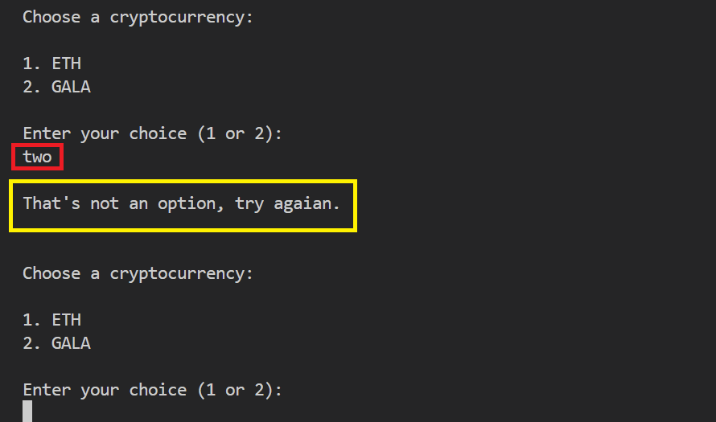
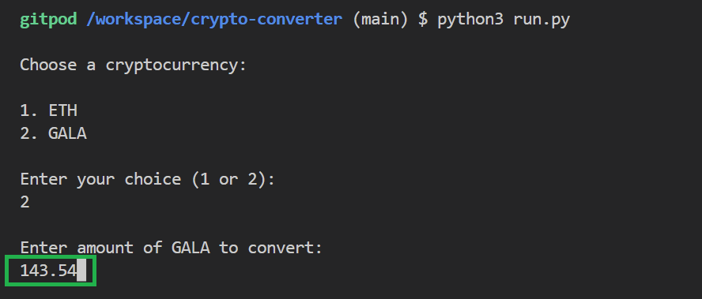
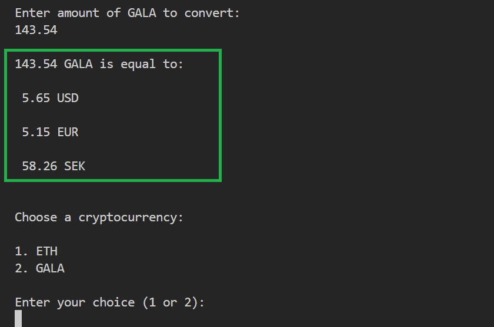
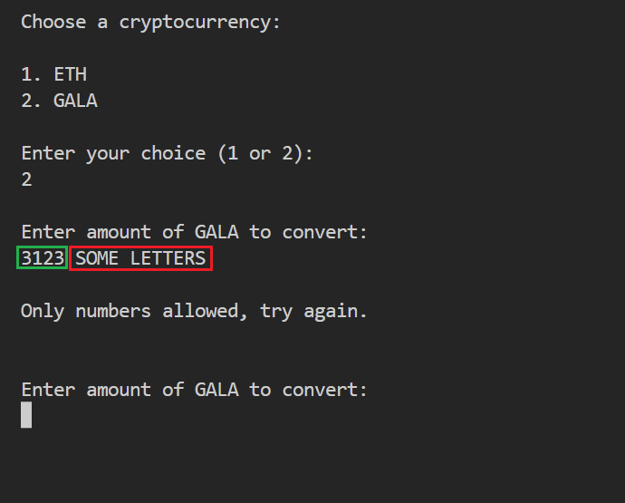

# Crypto converter
## Table of contents
### 1. [About](#about)
### 2. [Needed Tools](#needed-tools)
### 3. [Installation](#installation)
### 4. [Testing](#testing)
### 5. [Credits](#credits)
### 6. [Deployment](#deployment) 
### 7. [Design Choices](#design-choices) 
### 8. [Improvements](#improvements)    

# [About](#about)
### This program is a simple tool to convert Ethereum (ETH) and Gala (GALA) into USD, EUR and SEK. This is a tool for people that want up-to-date exchange rates for better decision-making. Due to lack of time, the options of crypto currencies is kept to minimum.     

# [Needed Tools](#needed-tools)
## To use this program, make sure you have: 
### - Python 3.x
### - "requests" library    

# [Installation](#installation)
## Follow this steps:
### 1. Download the project files or clone the repository.    
### 2. Install Python packages with this command in the terminal:   

#### (In this example, we are using GitPod)    
### 3. Get an API key for the Exchange Rate API by signing up [here](https://www.exchangerate-api.com/).    
### 4. Make a file named "key.py" in the project folder.   
### 5. Add this line to the file:  
### **EXCHANGERATE_API_KEY = "<YOUR_API_KEY>"**    
### 6.  You will replace the "<YOUR_API_KEY>" with your **actual** API key   

# [Testing](#testing)
### 1. Run the main script like this:
### **python3 run.py**
##### (Note: If you are using a lower version than Python 3.x, you may need to use **"python"** instead of **"python3"**)    
### 2. Replace "run.py" with your **actual** file name.
### 3. Choose a cryptocurrency 

##### In this case we chose option 2, that is "GALA".   

### 4. Make sure to enter only **digits** and to only use the numbers that is a choice. In this case "1" and "2".   

### **Otherwise:**

##### In this case user tried to choose "GALA" by writing "two" with letters.   

### 5. After choosing cryptocurrency to convert, you will be asked to enter the amount to be converted. 

##### Make sure to use a dot for entering decimals.   

### 6. The amount of the cryptocurrency you chose will now be converted to the currencies USD, EURO and SEK.

##### As you can the the amount have been converted using the APIs to get up-to-date rates. Now the program will continue to ask for a new choice to convert, to avoid for the user to need to start the program again after each conversion.   

### 7. Make sure to only enter digits, and to separate whole numbers and decimals using a dot (.).   

### **Otherwise:**

##### It will lead to an error saying "Only numbers allowed, try again."

  

# [Credits](#credits)
## Author
### This program is written by [Soroush G](https://www.linkedin.com/in/soroush-gholamreza-599173250/)   

## Special thanks to 
### [CoinGecko](https://www.coingecko.com/) - This project uses the [CoinGecko API](https://www.coingecko.com/en/api/documentation) for cryptocurrency prices.   

### [Exchange Rate API](https://www.exchangerate-api.com/) - This project uses the Exchange Rate API for exchange rates.   

### [Requests](https://docs.python-requests.org/en/latest/) - The "**requests**" library helps send HTTP requests.    

# [Deployment](#deployment)

# [Design Choices](#design-choices)
### - This tool uses a simple text interface, making it easy to use and work on many systems.    
### - The tool handles erros to help the tool to recover from issues, like if the user input is invalid, or API issues.   

# [Improvements](#improvements)
### **Here are some ideas for future adjustments that could improve user experience.**    

### 1. **Support more cryptocurrencies:** Expand the tool to support additional cryptocurrencies. That will make it more useful to wider range of users.   

### 2. **Flexibility:** Add possibility to convert crypto-to-crypto rates.